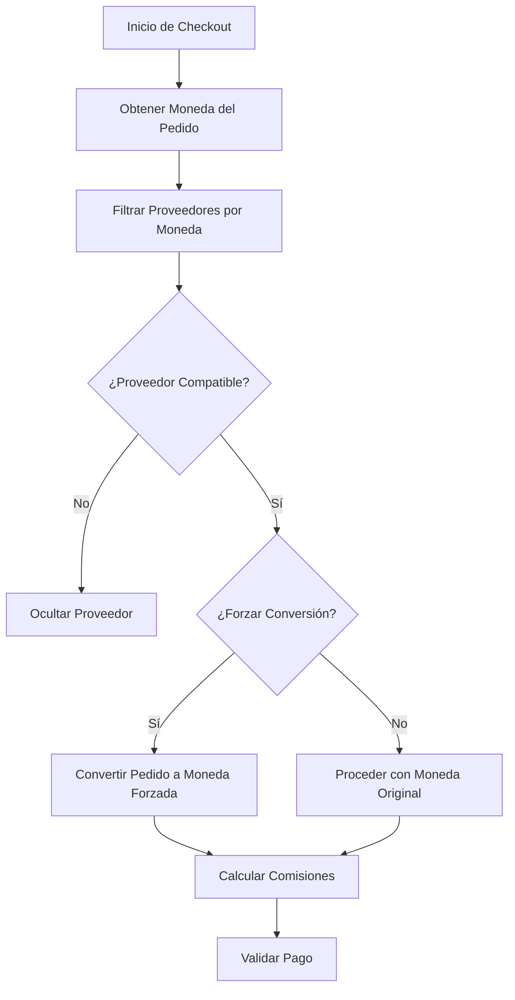

# Payment Currency - Odoo 16

[](https://www.gnu.org/licenses/lgpl-3.0)
[](https://www.odoo.com/)
[](https://www.python.org/)

Módulo específico para Odoo 16 que permite configurar monedas permitidas o forzar la conversión de moneda para proveedores de pago. Esta rama (`16.0`) contiene la versión estable para Odoo 16. Para soporte multi-versión, consulta la rama `main` del repositorio.

## 🌟 Características Principales

- ✅ **Configuración de monedas permitidas** por proveedor de pago
- ✅ **Conversión forzada de moneda** automática
- ✅ **Validación automática** de disponibilidad de monedas
- ✅ **Cálculo de comisiones** con soporte multi-moneda
- ✅ **Integración completa** con la API de pagos de Odoo 16
- ✅ **Interfaz intuitiva** para configuración en el backend
- ✅ **Filtrado en frontend** para métodos de pago compatibles con la moneda del pedido

## 📋 Estrategia de Versionamiento

Este repositorio soporta múltiples versiones de Odoo mediante ramas dedicadas:

- **Rama `main`**: Desarrollo general y multi-versión.
- **Rama `16.0`**: Versión estable para Odoo 16 (etiquetada como `v16.0.0`).
- Otras ramas: `17.0`, `18.0`, `19.0` para versiones futuras.

Para detalles, consulta [VERSIONING_STRATEGY.md](VERSIONING_STRATEGY.md) en la rama `main`.

## 📋 Requisitos

- **Odoo**: Versión 16.0
- **Python**: 3.8 o superior
- **Dependencias**: Módulo `payment` de Odoo (incluido en el core)

## 🚀 Instalación

### 1. Clonar el Repositorio
```bash
# Clonar el repositorio principal
git clone https://github.com/palbina/payment_currency.git

# Cambiar a la rama 16.0
cd payment_currency
git checkout 16.0
```

### 2. Instalar en Odoo
1. Copia la carpeta `payment_currency` al directorio de addons de tu instancia de Odoo 16.
2. Reinicia el servidor de Odoo.
3. En Odoo, ve a **Apps > Actualizar Lista de Aplicaciones**.
4. Busca "Payment Currency" e instala el módulo.

### 3. Verificación
- Accede a **Configuración > Pagos > Proveedores de Pago**.
- Confirma que los campos de monedas aparecen en los formularios.

## ⚙️ Configuración

### Configurar Monedas Permitidas
1. Ve a **Configuración > Pagos > Proveedores de Pago**.
2. Selecciona o crea un proveedor de pago.
3. En el formulario, usa el campo **Currencies** (etiquetas múltiples) para seleccionar monedas permitidas.
4. Guarda los cambios.

### Forzar Conversión de Moneda
1. Activa la opción **Force Currency**.
2. Selecciona la **Currency** objetivo.
3. El sistema convertirá automáticamente los pedidos a esta moneda durante el proceso de pago.

### Notas de Configuración
- Si no se configuran monedas específicas, se permiten todas las monedas activas.
- Asegura tasas de cambio actualizadas en **Configuración > Contabilidad > Monedas**.

## 📖 Uso

### En el Backend (Administración)
- Configura proveedores en **Pagos > Proveedores de Pago**.
- Prueba la validación: Crea un pedido con una moneda no permitida y verifica el filtrado.

### En el Frontend (Tienda Website)
- Durante el checkout, solo se muestran métodos de pago compatibles con la moneda del pedido.

### Ejemplos de Código (para Desarrolladores)
```python
# Verificar disponibilidad de moneda
provider = env['payment.provider'].browse(provider_id)
is_available = provider._is_currency_available(currency_id)

# Obtener monedas disponibles
available_currencies = provider._get_available_currencies()

# Calcular comisiones
fees = provider.compute_fees(amount=100.0, currency_id=currency_id, partner_country_id=country_id)
```

## 🔄 Flujo de Funcionamiento



## 🛠️ Estructura del Módulo

```
payment_currency/
├── __init__.py               # Inicialización
├── __manifest__.py           # Manifiesto para Odoo 16
├── PROJECT_CONTEXT.md        # Documentación técnica completa
├── controllers/              # Controladores para website_sale
│   ├── __init__.py
│   └── main.py               # Filtrado en frontend
├── models/                   # Modelos extendidos
│   ├── __init__.py
│   └── payment_acquirer.py   # Herencia de payment.provider
├── views/                    # Vistas XML
│   └── payment_acquirer.xml  # Formulario extendido
└── README.md                 # Documentación para Odoo 16
```

## 📚 Documentación Técnica Completa

Para información detallada sobre la arquitectura, cambios realizados, integración con Payment Webpay y troubleshooting avanzado, consulta:

**[PROJECT_CONTEXT.md](PROJECT_CONTEXT.md)** - Documentación técnica completa del proyecto

Este archivo incluye:
- Arquitectura detallada del módulo
- Todos los cambios realizados para Odoo 16
- Problemas encontrados y corregidos
- Integración con Payment Webpay
- Resumen técnico completo

## 🐛 Troubleshooting

### Problemas Comunes
- **Moneda no disponible**: Verifica las monedas configuradas. Asegúrate de que la moneda del pedido esté activa.
- **Error en conversión**: Actualiza tasas de cambio y reinicia Odoo.
- **Método no filtrado**: Limpia caché y verifica instalación.

### Depuración
Activa logs en Odoo con `--log-level=info`. Busca entradas de `payment_currency`.

### Mejoras Recientes (2025-11-09)
- ✅ **Logging completo** en todos los métodos para facilitar debugging
- ✅ **Validaciones de seguridad** en conversión de moneda
- ✅ **Manejo de excepciones** mejorado en controladores
- ✅ **Documentación completa** con docstrings y comentarios
- ✅ **Clase SaleOrder** añadida para conversión automática
- ✅ **Endpoint shop_payment_validate** implementado

## 📝 Changelog

### v16.0.0 (2025-11-09)
- ✅ **Migración completa** a Odoo 16
- ✅ **Cambio de `payment.acquirer` a `payment.provider`**
- ✅ **Implementación de filtrado por moneda** y conversión básica
- ✅ **Clase SaleOrder añadida** con método `_convert_to_currency()`
- ✅ **Endpoint `shop_payment_validate()`** implementado para conversión automática
- ✅ **Logging completo** en todos los métodos (INFO, DEBUG, ERROR)
- ✅ **Validaciones de seguridad** implementadas
- ✅ **Documentación completa** con docstrings y comentarios
- ✅ **Archivo PROJECT_CONTEXT.md** creado con documentación técnica detallada
- ✅ **Corrección de referencias XML** (`payment.payment_provider_form`)
- ✅ **Actualización de campo `provider` a `provider_code`**

### v16.0.0-beta (2025-11-07)
- Migración inicial a Odoo 16
- Cambio básico de `payment.acquirer` a `payment.provider`
- Implementación inicial de filtrado por moneda

Para changelogs de otras versiones, consulta las ramas correspondientes en el repositorio principal.

## 🤝 Contribuir

1. Forkea el repositorio.
2. Crea una rama: `git checkout -b feature/nueva-funcionalidad`.
3. Commit: `git commit -m "Agregar nueva funcionalidad"`.
4. Push: `git push origin feature/nueva-funcionalidad`.
5. Abre un Pull Request hacia `16.0`.

Sigue [VERSIONING_STRATEGY.md](VERSIONING_STRATEGY.md) en `main`.

## 📄 Licencia

LGPL-3 (Odoo Proprietary License v1.0).

## 👥 Autores y Agradecimientos

- **Daniel Santibáñez Polanco** - Desarrollo inicial - [Global Response](https://globalresponse.cl)
- **Kilo Code** - Migración a Odoo 16

Agradecimientos a la comunidad Odoo.

## 📞 Soporte

- **Issues**: [GitHub Issues](https://github.com/palbina/payment_currency/issues)
- **Repositorio**: [palbina/payment_currency](https://github.com/palbina/payment_currency)
- **Email**: Contacta vía GitHub o globalresponse.cl

---

**Última Actualización**: 2025-11-09
**Versión del Módulo**: 16.0.0
**Rama**: 16.0
**Estado**: ✅ Producción-ready
