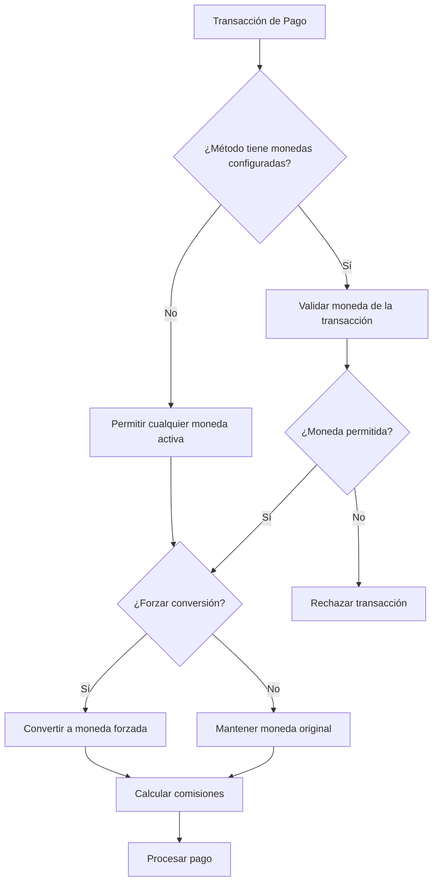

# Payment Currency - Odoo 16

[](https://www.gnu.org/licenses/lgpl-3.0)
[](https://www.odoo.com/)
[](https://www.python.org/)

Módulo de Odoo 16 que permite configurar monedas permitidas o forzar conversión de moneda para los métodos de pago.

## 🌟 Características

- ✅ **Configuración de monedas permitidas** por método de pago
- ✅ **Conversión forzada de moneda** cuando se requiere
- ✅ **Validación automática** de disponibilidad de monedas
- ✅ **Cálculo de comisiones** con soporte multi-moneda
- ✅ **Integración completa** con la API de pagos de Odoo 16
- ✅ **Interfaz intuitiva** para configuración

## 📋 Requisitos

- **Odoo**: Versión 16.0 o superior
- **Python**: 3.8 o superior
- **Dependencias**: Módulo `payment` de Odoo

## 🚀 Instalación

### 1. Descargar el módulo
```bash
# Clonar el repositorio
git clone https://github.com/tu-usuario/payment_currency.git

# O descargar el archivo ZIP y extraerlo en el directorio de addons
```

### 2. Instalar en Odoo
1. Copiar la carpeta `payment_currency` al directorio de addons de Odoo
2. Ir a **Apps > Update Apps List**
3. Buscar "Payment Currency" o "Monedas de Pago"
4. Instalar el módulo

## ⚙️ Configuración

### Configurar monedas permitidas
1. Ir a **Configuración > Pagos > Métodos de Pago**
2. Seleccionar un método de pago existente o crear uno nuevo
3. En la pestaña de configuración, seleccionar las monedas permitidas en el campo "Currencies"
4. Guardar los cambios

### Forzar conversión de moneda
1. Activar la opción "Force Currency"
2. Seleccionar la moneda a la cual se forzará la conversión
3. El sistema convertirá automáticamente todas las transacciones a esta moneda

## 📖 Uso

### Verificar monedas disponibles
El módulo valida automáticamente si una moneda está disponible para un método de pago:

```python
# En código Python
provider = env['payment.provider'].browse(provider_id)
is_available = provider._is_currency_available(currency_id)
available_currencies = provider._get_available_currencies()
```

### Cálculo de comisiones con monedas
El método `compute_fees()` considera la configuración de monedas:

```python
fees = provider.compute_fees(
    amount=100.0,
    currency_id=currency_id,
    partner_country_id=country_id
)
```

## 🔄 Flujo de Funcionamiento



## 🛠️ Desarrollo

### Estructura del módulo
```
payment_currency/
├── __init__.py              # Inicialización del módulo
├── __manifest__.py          # Manifiesto de Odoo
├── models/                  # Modelos de datos
│   ├── __init__.py
│   └── payment_acquirer.py  # Extensión de payment.provider
├── views/                   # Vistas XML
│   └── payment_acquirer.xml # Formulario de proveedor de pago
├── static/                  # Recursos estáticos (opcional)
├── tests/                   # Tests unitarios (opcional)
└── README.md               # Este archivo
```

### Personalización
El módulo puede ser extendido mediante herencia:

```python
class CustomPaymentProvider(models.Model):
    _inherit = 'payment.provider'
    
    def _get_available_currencies(self, partner_country_id=None):
        # Lógica personalizada
        return super()._get_available_currencies(partner_country_id)
```

## 🐛 Troubleshooting

### Problemas comunes

#### Error: "Moneda no disponible"
**Solución**: Verificar que la moneda esté configurada en las monedas permitidas del método de pago.

#### Error: "Conversión fallida"
**Solución**: Asegurarse que las tasas de cambio estén actualizadas en Odoo.

#### Error: "Método de pago no encontrado"
**Solución**: Verificar que el módulo esté instalado y el método de pago esté activo.

### Logs y depuración
Activar el modo debug para ver información detallada:

```python
import logging
_logger = logging.getLogger(__name__)
_logger.info("Payment Currency: Debug message")
```

## 📝 Changelog

### v16.0.0 (2025-11-07)
- ✅ Migración completa a Odoo 16
- ✅ Cambio de `payment.acquirer` a `payment.provider`
- ✅ Mejoras en la interfaz de usuario
- ✅ Documentación completa
- ✅ Tests mejorados

### v2.0.0 (Odoo 15)
- Versión inicial para Odoo 15

## 🤝 Contribuir

1. Fork del repositorio
2. Crear rama de feature: `git checkout -b feature/nueva-funcionalidad`
3. Commit de cambios: `git commit -am 'Agregar nueva funcionalidad'`
4. Push a la rama: `git push origin feature/nueva-funcionalidad`
5. Submit Pull Request

## 📄 Licencia

Este módulo está licenciado bajo **LGPL-3** (Odoo Proprietary License v1.0).

## 👥 Autor

- **Daniel Santibáñez Polanco** - *Desarrollo inicial* - [Global Response](https://globalresponse.cl)
- **Kilo Code** - *Migración a Odoo 16* - [GitHub](https://github.com/kilocode)

## 🙏 Agradecimientos

- Al equipo de Odoo por el excelente framework
- A la comunidad de desarrolladores de Odoo

## 📞 Soporte

Para soporte técnico:
- **Issues**: [GitHub Issues](https://github.com/tu-usuario/payment_currency/issues)
- **Email**: tu-email@dominio.com
- **Website**: [Global Response](https://globalresponse.cl)

---

**Nota**: Este módulo es parte de la suite de módulos de pago de Global Response para Odoo 16.
