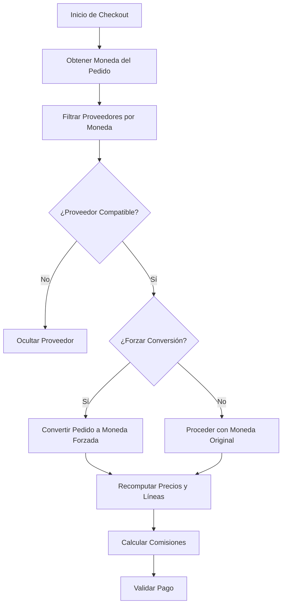

# Payment Currency - Módulo Multi-Versión para Odoo

[](https://www.gnu.org/licenses/lgpl-3.0)
[](https://www.odoo.com/)
[](https://www.python.org/)

Módulo de Odoo que permite configurar monedas permitidas o forzar la conversión de moneda para proveedores de pago. Esta rama `main` sirve como punto de entrada multi-versión, con ramas específicas para cada versión de Odoo. La última versión estable es para Odoo 19 (rama `19.0`).

## 🌟 Características Principales

- ✅ **Configuración de monedas permitidas** por proveedor de pago
- ✅ **Conversión forzada de moneda** automática con soporte para pricelists
- ✅ **Validación automática** de disponibilidad de monedas
- ✅ **Cálculo de comisiones** con soporte multi-moneda y API v2
- ✅ **Integración completa** con la API de pagos de Odoo
- ✅ **Interfaz intuitiva** para configuración en el backend
- ✅ **Filtrado en frontend** para métodos de pago compatibles con la moneda del pedido
- ✅ **Soporte para recomputo** de líneas de pedido durante conversiones

## 📋 Estrategia de Versionamiento y Ramas

Este repositorio utiliza una estructura multi-rama para mantener compatibilidad con diferentes versiones de Odoo:

- **Rama `main`**: Rama principal para desarrollo general, documentación y estrategia de versionamiento. Refleja la última versión (Odoo 19).
- **Rama `16.0`**: Versión específica y estable para Odoo 16 (etiquetada como `v16.0.0`).
- **Rama `19.0`**: Versión específica y estable para Odoo 19 (etiquetada como `v19.0.0`).
- Ramas futuras: `17.0`, `18.0` para versiones intermedias.

Para usar una versión específica:
1. Cambia a la rama correspondiente: `git checkout 19.0`
2. Instala desde esa rama en tu instancia de Odoo.

Consulta [VERSIONING_STRATEGY.md](VERSIONING_STRATEGY.md) para detalles completos sobre el flujo de trabajo, merges y releases.

## 📋 Requisitos

- **Odoo**: Versión compatible con la rama seleccionada (16.0+ recomendada)
- **Python**: 3.10 o superior
- **Dependencias**: Módulo `payment` de Odoo (incluido en el core)

## 🚀 Instalación

### 1. Clonar el Repositorio
```bash
# Clonar el repositorio principal
git clone https://github.com/palbina/payment_currency.git

# Cambiar a la rama deseada (ejemplo para Odoo 19)
cd payment_currency
git checkout 19.0
```

### 2. Instalar en Odoo
1. Copia la carpeta `payment_currency` al directorio de addons de tu instancia de Odoo.
2. Reinicia el servidor de Odoo.
3. En Odoo, ve a **Apps > Actualizar Lista de Aplicaciones**.
4. Busca "Payment Currency" e instala el módulo.

### 3. Verificación
- Accede a **Configuración > Pagos > Proveedores de Pago**.
- Confirma que los campos de monedas aparecen en los formularios.

## ⚙️ Configuración

### Configurar Monedas Permitidas
1. Ve a **Configuración > Pagos > Proveedores de Pago**.
2. Selecciona o crea un proveedor de pago.
3. En el formulario, usa el campo **Currencies** (etiquetas múltiples) para seleccionar monedas permitidas.
4. Guarda los cambios.

### Forzar Conversión de Moneda
1. Activa la opción **Force Currency**.
2. Selecciona la **Currency** objetivo en el campo correspondiente.
3. El sistema convertirá automáticamente los pedidos a esta moneda durante el proceso de pago, actualizando la pricelist y recomputando precios.

### Notas de Configuración
- Si no se configuran monedas específicas, se permiten todas las monedas activas.
- La conversión crea pricelists temporales si es necesario y asegura compatibilidad con países y partners.

## 📖 Uso

### En el Backend (Administración)
- Configura proveedores en **Pagos > Proveedores de Pago**.
- Prueba la validación: Crea un pedido con una moneda no permitida y verifica que se filtre en el frontend.

### En el Frontend (Tienda Website)
- Durante el checkout, solo se muestran métodos de pago compatibles con la moneda del pedido.
- Si se fuerza una conversión, el pedido se ajusta automáticamente antes de validar el pago.

### Ejemplos de Código (para Desarrolladores)
```python
# Verificar disponibilidad de moneda
provider = env['payment.provider'].browse(provider_id)
is_available = provider._is_currency_available(currency_id)

# Obtener monedas disponibles
available_currencies = provider._get_available_currencies()

# Calcular comisiones
fees = provider.compute_fees(amount=100.0, currency_id=currency_id, partner_country_id=country_id)
```

## 🔄 Flujo de Funcionamiento



## 🛠️ Estructura del Módulo

```
payment_currency/
├── __init__.py               # Inicialización
├── __manifest__.py           # Manifiesto (versión por rama)
├── controllers/              # Controladores para website_sale
│   ├── __init__.py
│   └── main.py               # Filtrado y conversión en frontend
├── models/                   # Modelos extendidos
│   ├── __init__.py
│   └── payment_acquirer.py   # Herencia de payment.provider y sale.order
├── views/                    # Vistas XML
│   └── payment_acquirer.xml  # Formulario extendido
├── README.md                 # Documentación principal
├── VERSIONING_STRATEGY.md    # Estrategia de ramas
└── MIGRACION_*.md            # Guías de migración por versión
```

## 🐛 Troubleshooting

### Problemas Comunes
- **Moneda no disponible**: Verifica las monedas configuradas en el proveedor. Asegúrate de que la moneda del pedido esté activa en Odoo.
- **Error en conversión**: Actualiza las tasas de cambio en **Configuración > Contabilidad > Monedas**. Verifica pricelists disponibles.
- **Método no filtrado**: Reinicia Odoo y actualiza la caché del navegador. Confirma que el controlador esté cargado.

### Depuración
Activa logs en Odoo con `--log-level=info`. Busca entradas de `payment_currency` para detalles.

## 📝 Changelog

### v19.0.0 (2025-11-09)
- Migración completa a Odoo 19 con soporte para API v2 de pagos.
- Adición de herencia en `sale.order` para conversión de pricelists.
- Optimizaciones en controlador para `payment_methods_sudo`.
- Mejoras en validación y performance.

### v16.0.0 (2025-11-07)
- Migración inicial a Odoo 16.
- Cambio de `payment.acquirer` a `payment.provider`.
- Implementación básica de filtrado por moneda.

Para changelogs completos por versión, consulta las ramas específicas.

## 🤝 Contribuir

1. Forkea el repositorio.
2. Crea una rama en la versión relevante: `git checkout -b feature/nueva-funcionalidad 19.0`.
3. Commit: `git commit -m "Agregar nueva funcionalidad"`.
4. Push: `git push origin feature/nueva-funcionalidad`.
5. Abre un Pull Request hacia la rama correspondiente.

Sigue las guías en [VERSIONING_STRATEGY.md](VERSIONING_STRATEGY.md).

## 📄 Licencia

LGPL-3 (Odoo Proprietary License v1.0). Ver [LICENSE](LICENSE) para detalles.

## 👥 Autores y Agradecimientos

- **Daniel Santibáñez Polanco** - Desarrollo inicial - [Global Response](https://globalresponse.cl)
- **Kilo Code** - Migraciones y optimizaciones multi-versión

Agradecimientos a la comunidad Odoo por el framework y soporte.

## 📞 Soporte

- **Issues**: [GitHub Issues](https://github.com/palbina/payment_currency/issues)
- **Repositorio**: [palbina/payment_currency](https://github.com/palbina/payment_currency)
- **Email**: Contacta vía GitHub o globalresponse.cl

---

**Última Actualización**: 2025-11-09  
**Versión del Módulo**: Multi-versión (última: 19.0.0)
