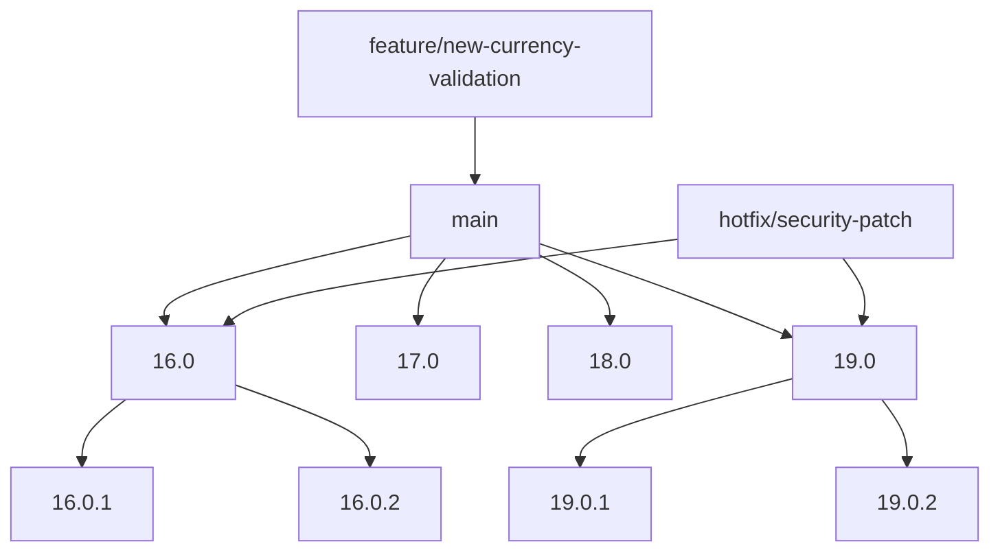

# Estrategia de Versionamiento - Payment Currency

## 🎯 Visión General

Este documento describe la estrategia de versionamiento y mantenimiento del módulo `payment_currency` para múltiples versiones de Odoo.

## 🌳 Estructura de Ramas



### Descripción de Ramas

| Rama | Propósito | Estado | Versión Odoo |
|------|-----------|--------|--------------|
| `main` | Desarrollo principal | ✅ Activa | Base |
| `16.0` | Versión estable para Odoo 16 | ✅ Activa | 16.0+ |
| `17.0` | Versión para Odoo 17 | 🔄 Futura | 17.0+ |
| `18.0` | Versión para Odoo 18 | 🔄 Futura | 18.0+ |
| `19.0` | Versión para Odoo 19 | 🔄 En desarrollo | 19.0+ |

## 📦 Política de Versiones

### Versionado Semánttico

```
MAJOR.MINOR.PATCH
```

- **MAJOR**: Cambios incompatibles en API (ej: 16.0.0 → 17.0.0)
- **MINOR**: Nuevas funcionalidades compatibles (ej: 16.0.0 → 16.1.0)
- **PATCH**: Bug fixes y mejoras menores (ej: 16.0.0 → 16.0.1)

### Ciclo de Vida por Versión

| Versión Odoo | Estado Módulo | Soporte | Última Versión |
|--------------|---------------|---------|-----------------|
| 16.0 | ✅ Mantenimiento | LTS | 16.0.x |
| 17.0 | 🔄 Desarrollo | Activo | 17.0.x |
| 18.0 | 🔄 Planificación | Futuro | 18.0.x |
| 19.0 | 🔄 Desarrollo | Activo | 19.0.x |

## 🔄 Flujo de Trabajo

### 1. Desarrollo de Nuevas Funcionalidades

```bash
# Crear rama de feature desde main
git checkout main
git checkout -b feature/nueva-funcionalidad

# Desarrollar y hacer commit
git add .
git commit -m "feat: Add new currency validation feature"

# Fusionar con main
git checkout main
git merge feature/nueva-funcionalidad

# Portar a versiones específicas
git checkout 16.0
git cherry-pick <commit-hash>
git checkout 19.0
git cherry-pick <commit-hash>
```

### 2. Corrección de Bugs (Hotfixes)

```bash
# Crear hotfix desde la versión afectada
git checkout 16.0
git checkout -b hotfix/critical-bug-fix

# Arreglar y commitear
git add .
git commit -m "fix: Resolve currency conversion issue"

# Fusionar con versión afectada
git checkout 16.0
git merge hotfix/critical-bug-fix

# Portar a otras versiones si aplica
git checkout 19.0
git cherry-pick <commit-hash>

# Crear tag de patch
git tag -a v16.0.1 -m "Release v16.0.1: Critical bug fix"
```

### 3. Lanzamiento de Versiones

```bash
# Para versión major/minor
git checkout 19.0
git merge main
git tag -a v19.1.0 -m "Release v19.1.0: New features"

# Para versión patch
git checkout 16.0
git tag -a v16.0.1 -m "Release v16.0.1: Bug fixes"

# Subir tags
git push origin --tags
```

## 🏷️ Convención de Commits

### Tipos de Commits

| Tipo | Descripción | Ejemplo |
|------|-------------|---------|
| `feat` | Nueva funcionalidad | `feat: Add currency auto-detection` |
| `fix` | Corrección de bug | `fix: Resolve conversion rate issue` |
| `docs` | Documentación | `docs: Update installation guide` |
| `style` | Formato/código limpio | `style: Fix code formatting` |
| `refactor` | Refactorización | `refactor: Optimize currency validation` |
| `test` | Tests | `test: Add unit tests for conversion` |
| `chore` | Mantenimiento | `chore: Update dependencies` |

### Formato

```
<tipo>[<alcance>]: <descripción>

[opcional: cuerpo del commit]

[opcional: footer con issue #]
```

**Ejemplos:**
```bash
feat(payment): Add automatic currency detection based on country
fix(conversion): Resolve rounding issues in fee calculation
docs(readme): Update installation instructions for Odoo 19
```

## 🚀 Proceso de Lanzamiento

### Checklist de Lanzamiento

#### Antes del Lanzamiento
- [ ] Todos los tests pasan
- [ ] Documentación actualizada
- [ ] Changelog actualizado
- [ ] Código revisado y aprobado
- [ ] Performance validada

#### Durante el Lanzamiento
- [ ] Crear tag de versión
- [ ] Generar release notes
- [ ] Publicar en GitHub
- [ ] Notificar a usuarios

#### Después del Lanzamiento
- [ ] Monitorear issues
- [ ] Planear siguiente versión
- [ ] Actualizar documentación

### Release Notes Template

```markdown
# Release v{VERSION}

## 🎉 Nuevas Funcionalidades
- Feature 1 description
- Feature 2 description

## 🐛 Correcciones
- Bug fix 1 description
- Bug fix 2 description

## 🔧 Mejoras
- Improvement 1 description
- Improvement 2 description

## 📦 Instalación
```bash
pip install odoo-payment-currency=={VERSION}
```

## 🔄 Actualización
Desde versión {PREV_VERSION}:
```bash
git checkout v{VERSION}
```

## ⚠️ Notas Importantes
- Breaking changes if any
- Migration requirements
- Deprecated features
```

## 🔄 Migración entre Versiones

### De Odoo 16 a 19

1. **Backup**: Respaldar base de datos y módulo actual
2. **Testing**: Probar en entorno de desarrollo
3. **Migración**: Seguir guía específica de migración
4. **Validación**: Verificar funcionalidad completa
5. **Producción**: Desplegar en producción

### Compatibilidad hacia Atrás

| Característica | 16.0 | 17.0 | 18.0 | 19.0 |
|----------------|------|------|------|------|
| Currency configuration | ✅ | ✅ | ✅ | ✅ |
| Forced conversion | ✅ | ✅ | ✅ | ✅ |
| Multi-provider | ✅ | ✅ | ✅ | ✅ |
| API v2 | ❌ | ✅ | ✅ | ✅ |
| Advanced validation | ❌ | ❌ | ✅ | ✅ |

## 📊 Métricas y KPIs

### Métricas de Calidad
- **Coverage de tests**: >90%
- **Performance**: <2s respuesta
- **Issues abiertos**: <10
- **Tiempo de respuesta**: <48h

### Métricas de Adopción
- **Downloads por versión**
- **Issues reportados vs resueltos**
- **Contribuciones de comunidad**
- **Rating en Odoo Apps**

## 🛠️ Herramientas y Automatización

### GitHub Actions (Recomendado)

```yaml
name: CI/CD Pipeline
on: [push, pull_request]
jobs:
  test:
    strategy:
      matrix:
        odoo-version: [16.0, 17.0, 18.0, 19.0]
    runs-on: ubuntu-latest
    steps:
      - uses: actions/checkout@v3
      - name: Test on Odoo ${{ matrix.odoo-version }}
        run: |
          # Setup Odoo environment
          # Run tests
          # Validate functionality
```

### Automatización de Releases

```yaml
name: Auto Release
on:
  push:
    tags:
      - 'v*'
jobs:
  release:
    runs-on: ubuntu-latest
    steps:
      - name: Create Release
        uses: actions/create-release@v1
        with:
          tag_name: ${{ github.ref }}
          release_name: Release ${{ github.ref }}
```

## 📋 Responsabilidades

### Maintainers
- **Kilo Code**: Lead maintainer, Odoo 19+
- **Daniel Santibáñez**: Original author, Odoo 16

### Reviewers
- Revisión de código
- Validación de funcionalidad
- Aprobación de releases

### Community Contributors
- Reporte de bugs
- Sugerencias de mejoras
- Contribuciones de código

## 🔄 Roadmap

### Q1 2025
- [ ] Completar migración a Odoo 19
- [ ] Establecer CI/CD pipeline
- [ ] Publicar en Odoo Apps Store

### Q2 2025
- [ ] Desarrollo para Odoo 17
- [ ] Mejoras en UI/UX
- [ ] Advanced currency features

### Q3 2025
- [ ] Preparación para Odoo 18
- [ ] Performance optimizations
- [ ] Community features

### Q4 2025
- [ ] LTS support planning
- [ ] Documentation improvements
- [ ] v20.0 planning

---

**Última actualización**: 2025-11-08  
**Próxima revisión**: 2025-12-01  
**Dueño**: Kilo Code